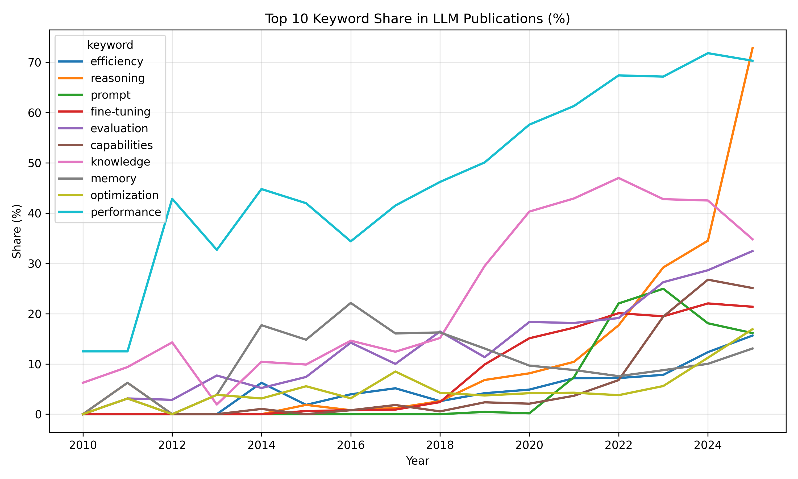
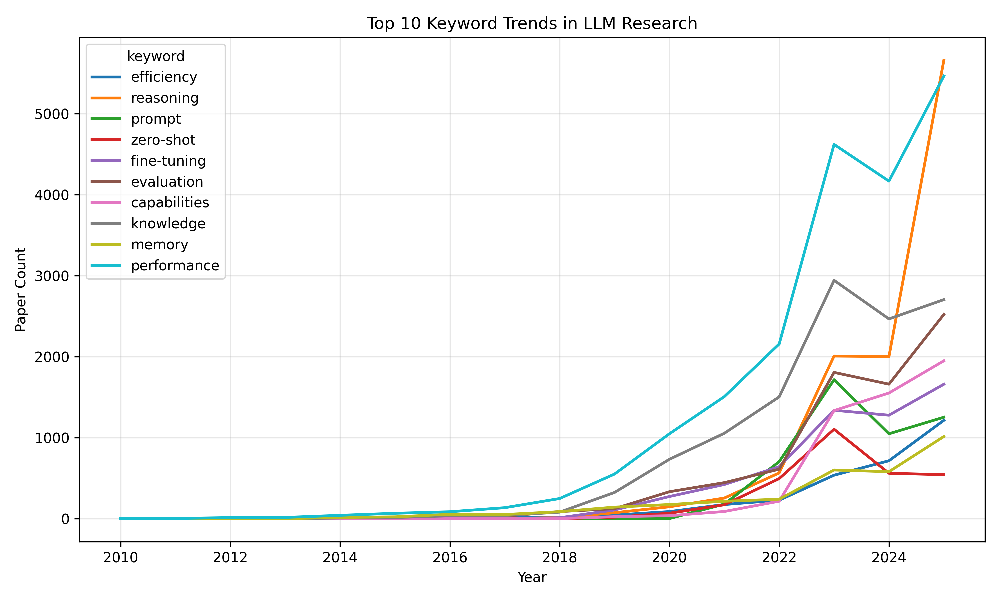
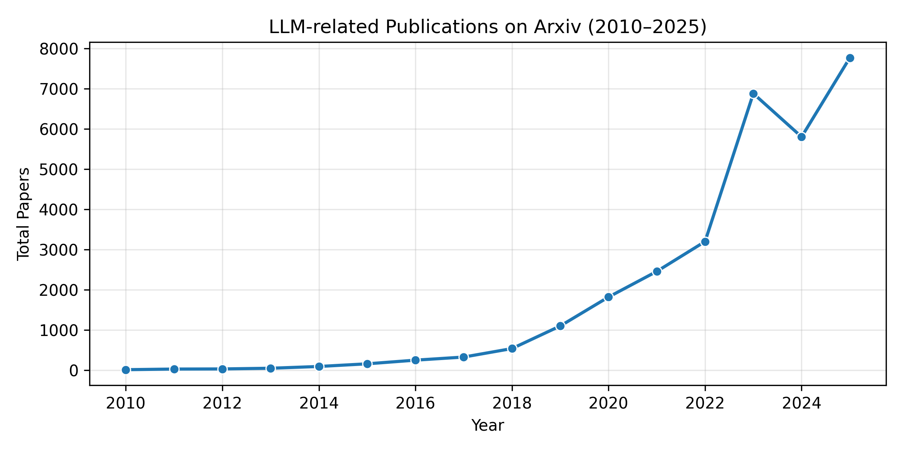

<div align="right">

**[🇬🇧 English](README.md)** | **[🇷🇺 Русский](README.ru.md)** | **[🇨🇳 中文](README.zh.md)**

</div>

# 🧠 Анализ применения и вывода больших языковых моделей (LLM)

---

## 📘 Описание проекта

Цель проекта — проанализировать **применение и поведение больших языковых моделей (Large Language Models, LLM)** в разных областях.  
Собирая и анализируя данные из различных источников (Arxiv, Reddit, Kaggle и др.), мы стремимся:

- 📊 Отслеживать исследовательские и отраслевые тенденции LLM  
- 💬 Изучить, как структура запроса влияет на качество ответа  
- 🌐 Анализировать обсуждения LLM на социальных платформах  
- 🔮 Прогнозировать перспективные направления развития в ближайшие 3 года  

---

## 👥 Авторы и группа

**Авторы:** Чжао Чэньхао · Чэнь Вэйпэн · Ван Сюанью  
**Группа:** 5140904/50102 · 5140904/50101  

---


## 📊 Текущий прогресс (на октябрь 2025 года)

**✅ Выполненные задачи по сбору данных:**

| Задача | Описание | Статус |
|--------|-----------|--------|
| 🏭 Статистика по отраслям | Собраны данные о публикациях LLM в различных отраслях (образование, медицина, финансы и др.) | ✅ Готово |
| 📈 Исследовательские тенденции | Собраны данные о публикациях и ключевых словах на Arxiv | ✅ Готово |
| 💬 Структура запросов | Создан набор данных для анализа качества ответов | ✅ Готово |
| 🌐 Социальные платформы | Собраны данные обсуждений LLM на Reddit | ✅ Готово |

| Этап | Описание | Статус |
|------|----------|:------:|
| 🏭 Сбор данных | Сбор данных из различных источников: Arxiv, Reddit, Kaggle и др. | ✅ Завершено |
| 🧹 Очистка данных | Приведение форматов и обработка пропусков в наборах данных | ✅ Завершено |
| 🧩 Интеграция данных | Формирование единой мультимодальной структуры данных для анализа | ✅ Завершено |
| 📊 Первичный анализ | Проведение EDA и визуализаций в Jupyter Notebooks | ✅ Завершено |

---

## 📂 Наборы данных

Все наборы данных хранятся в директории `/data`.  

| Файл | Описание | Источник / Скрипт |
|------|-----------|------------------|
| **`arxiv_stats_by_industry.csv`** | Статистика годовых публикаций LLM по отраслям | `scripts/collect_publication_stats.py` |
| **`arxiv_trends_by_month.csv`** | Ежемесячные тренды Arxiv и частота ключевых слов (*alignment, efficiency, reasoning*) | `scripts/collect_arxiv_trends.py` |
| **`prompt_examples_dataset.csv`** | Различные типы запросов для анализа качества ответов | Kaggle · Prompt Engineering Dataset |
| **`realm_reddit_sample_raw.csv`** | Подмножество Reddit из Hugging Face “kkChimmy/REALM”, 2000 записей об использовании LLM | `scripts/collect_reddit_data.py` |

---

## 🌐 Результаты интерактивного анализа данных

Ниже представлены интерактивные визуализации, созданные на основе собранных данных.  
Вы можете исследовать их напрямую через GitHub Pages:

| Визуализация | Описание | Ссылка |
|--------------|----------|-------|
| **Распределение ключевых слов Arxiv** | Распределение наиболее популярных ключевых слов в научных статьях по ИИ | [🔗 Посмотреть интерактивную диаграмму](https://huaichen446.github.io/LLM-Application-Analysis/arxiv_keyword_share.html) |
| **Тенденции ключевых слов Arxiv** | Эволюция популярности ключевых слов с течением времени | [🔗 Посмотреть интерактивную диаграмму](https://huaichen446.github.io/LLM-Application-Analysis/arxiv_keyword_trends.html) |
| **Общий тренд публикаций Arxiv** | Общие тенденции публикаций по темам ИИ | [🔗 Посмотреть интерактивную диаграмму](https://huaichen446.github.io/LLM-Application-Analysis/arxiv_total_trend.html) |

---

### 🖼️ Статические превью

Для быстрого просмотра на GitHub:

| Распределение ключевых слов | Тенденции ключевых слов | Годовой тренд |
|-----------------------------|-----------------------|---------------|
|  |  |  |


## 🧱 Структура проекта

```bash
LLM-Application-Analysis/
│
├── data/              # Наборы данных
├── notebooks/         # Jupyter Notebooks для анализа и визуализации
├── scripts/           # Скрипты для сбора и обработки данных
├── results/           # Результаты и графики
└── docs/              # Дополнительные документы и заметки
